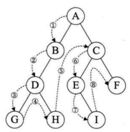
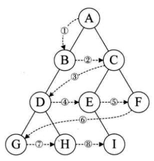

# 二叉树前序遍历、中序遍历、后序遍历、层序遍历

《大话数据结构》

## 为什么叫前序、后序、中序

一棵二叉树由根结点、左子树和右子树三部分组成，若规定 D、L、R 分别代表遍历根结点、遍历左子树、遍历右子树，则二叉树的遍历方式有 6 种：DLR、DRL、LDR、LRD、RDL、RLD。由于先遍历左子树和先遍历右子树在算法设计上没有本质区别，所以，只讨论三种方式：

DLR--前序遍历（根在前，从左往右，一棵树的根永远在左子树前面，左子树又永远在右子树前面 ）

LDR--中序遍历（根在中，从左往右，一棵树的左子树永远在根前面，根永远在右子树前面）

LRD--后序遍历（根在后，从左往右，一棵树的左子树永远在右子树前面，右子树永远在根前面）

总结： 序由根节点的遍历顺序决定

需要注意几点：

1. 根是相对的，对于整棵树而言只有一个根，但对于每棵子树而言，又有自己的根。比如对于下面三个图，对于整棵树而言，A是根，A分别在最前面、中间、后面被遍历到。而对于D，它是G和H的根，对于D、G、H这棵小树而言，顺序分别是DGH、GDH、GHD；对于C，它是E和F的根，三种排序的顺序分别为： CEF、ECF、EFC。是不是根上面的DLR、LDR、LRD一模一样呢～～

2. 整棵树的起点，就如上面所说的，从A开始，前序遍历的话，一棵树的根永远在左子树前面，左子树又永远在右子树前面，你就找他的起点好了。

3. 二叉树结点的先根序列、中根序列和后根序列中，所有叶子结点的先后顺序一样

4. 建议看看文末第3个参考有趣详细的推导

5. 下面的树按照前序，中序，后序遍历后是

   前序：根-左-右 A-B-D-G-H-C-E-I-F

   中序：左-根-右 G-D-H-B-A-E-I-C-F

   后序：左-右-根  G-H-D-B-I-E-F-C-A




## 算法上的前中后序遍历

```javascript
// 前序
const backList = (node) => {
  let list = []
  if(node){
    list.push(node.val)
    backList(node.left)
    backList(node.right)
  }
  return list
}


// 中序
const backList = (node) => {
  let list = []
  if(node){
    backList(node.left)
    list.push(node.val)
    backList(node.right)
  }
}


// 后序
const backList = (node) => {
  let list = []
  if(node){
        backList(node.left)
        backList(node.right)
        list.push(node.val)
  }
}
```


## 层序遍历

 层序遍历嘛，就是按层，从上到下，从左到右遍历，这个没啥好说的。

